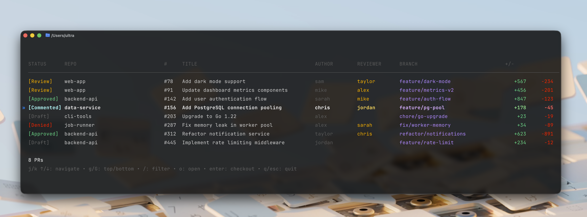

<picture>
  <source media="(prefers-color-scheme: dark)" srcset="sup-dark.png">
  <source media="(prefers-color-scheme: light)" srcset="sup.png">
  
</picture>

[](https://go.dev)
[](https://github.com/superultrainc/sup/releases)
[](LICENSE)

A terminal UI for browsing and checking out GitHub PRs.

<picture>
  <source media="(prefers-color-scheme: dark)" srcset="screenshot-dark.png">
  <source media="(prefers-color-scheme: light)" srcset="screenshot-light.png">
  
</picture>

## Requirements

- [gh](https://cli.github.com/) CLI (authenticated via `gh auth login`)

## Install

```bash
curl -sSL https://raw.githubusercontent.com/superultrainc/sup/main/install.sh | bash
```

Or with Go (requires manual shell setup):
```bash
go install github.com/superultrainc/sup@latest
```

If using `go install`, add this to your `~/.zshrc` or `~/.bashrc` for auto-cd after checkout:
```bash
sup() {
  rm -f /tmp/sup-selection
  command sup "$@"
  if [[ -f /tmp/sup-selection ]]; then
    cd "$(cat /tmp/sup-selection)"
    rm -f /tmp/sup-selection
  fi
}
```

## Usage

```bash
sup          # Show PRs from your GitHub organizations (auto-detected)
sup --mine   # Show PRs you're involved in (authored, reviewing, mentioned)
```

**Zero config required** - sup automatically detects your GitHub organizations.

Select a PR and press Enter to check it out locally.

## Keybindings

| Key | Action |
|-----|--------|
| `j` / `↓` | Move down |
| `k` / `↑` | Move up |
| `g` | Go to top |
| `G` | Go to bottom |
| `/` | Filter PRs (prefix with `@` to filter by reviewer) |
| `r` | Filter to your review requests |
| `o` | Open PR in browser |
| `O` | Open all PRs needing review in browser |
| `Enter` | Checkout PR |
| `q` / `Esc` | Quit |

## Configuration (optional)

| Variable | Description | Default |
|----------|-------------|---------|
| `SUP_ORG` | Override org detection (comma-separated) | auto-detected |
| `SUP_DEV_DIR` | Override repo location search | auto-detected |

Repos are automatically found in: `~/Development`, `~/dev`, `~/projects`, `~/code`, `~/src`, `~/repos`, `~/github`, `~/git`, `~`
