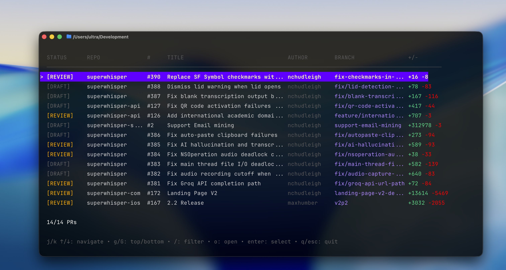

# gpr

A terminal UI for browsing and selecting open PRs across the superultrainc organization.



## Install

```bash
./install.sh
```

This builds the binary, installs it to `~/.local/bin`, and adds the `gco` shell function to your shell config.

## Usage

### `gpr`

Opens an interactive PR picker showing all open PRs in the org. Select a PR to write its info to `~/.gpr-selection`.

### `gco`

Runs `gpr`, then checks out the selected PR's branch in the local repo:

```bash
gco
# Opens picker → selects PR → cd ~/Development/<repo> → git checkout <branch>
```

## Keybindings

| Key | Action |
|-----|--------|
| `j` / `↓` | Move down |
| `k` / `↑` | Move up |
| `g` | Go to top |
| `G` | Go to bottom |
| `/` | Filter PRs |
| `o` | Open PR in browser |
| `Enter` | Select PR |
| `q` / `Esc` | Quit |

## Requirements

- [gh](https://cli.github.com/) CLI (authenticated)
- [jq](https://jqlang.github.io/jq/) (for the `gco` function)
- Go 1.21+ (for building)
